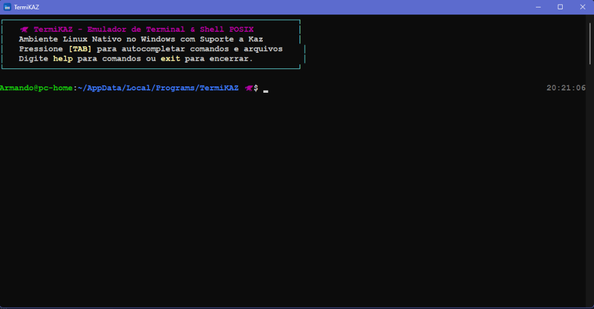

<div align="center">

# 🦅 TermiKAZ

### Emulador de Terminal & Shell Linux/POSIX Nativo para Windows com Integração à Linguagem Kaz

[-blue.svg?style=flat&logo=windows)](https://microsoft.com/windows)
[](https://github.com/kazlang/kaz)
[](LICENSE)
[](https://github.com/kazlang/termikaz/releases)

<br>



<br><br>

**TermiKAZ** é um emulador de terminal e ambiente shell POSIX de altíssimo desempenho desenvolvido em **Rust**. Projetado especificamente para desenvolvedores no Windows, ele oferece um ecossistema completo de comandos Linux nativos (sem necessidade de WSL, Cygwin ou máquinas virtuais), experiência rica de autocompletion com **`[TAB]`**, interface gráfica moderna acelerada por GPU e integração in-process com o ecossistema da linguagem de programação **Kaz** (`kaz.exe`).

</div>

---

## 📑 Sumário

- [Visão Geral](#-visão-geral)
- [Principais Recursos](#-principais-recursos)
- [Integração com a Linguagem Kaz](#-integração-com-a-linguagem-kaz)
- [Autocomplete Rápido com TAB](#-autocomplete-rápido-com-tab)
- [Interface Gráfica & ConPTY](#-interface-gráfica--conpty)
- [Instalação](#-instalação)
  - [Instaladores Oficiais Windows](#instaladores-oficiais-windows)
  - [Configuração de Atalhos](#configuração-de-atalhos)
- [Guia de Uso](#-guia-de-uso)
  - [1. Shell Interativo (CLI)](#1-shell-interativo-cli)
  - [2. Emulador de Terminal Gráfico (GUI)](#2-emulador-de-terminal-gráfico-gui)
  - [3. Modo de Comando Único (`-c`)](#3-modo-de-comando-único--c)
  - [4. Execução Direta de Scripts Kaz](#4-execução-direta-de-scripts-kaz)
- [Comandos Linux Nativos Suportados](#-comandos-linux-nativos-suportados)
- [Arquitetura & Ecossistema](#-arquitetura--ecossistema)
- [Licença](#-licença)

---

## 🌟 Visão Geral

O TermiKAZ resolve o clássico atrito de desenvolvimento no Windows: a necessidade de comandos Linux ágeis (`ls`, `grep`, `cat`, `curl`, `tree`, pipes, etc.) sem o overhead de inicialização de subsistemas pesados como o WSL. 

Tudo é compilado em código de máquina nativo x64, com tradução bidirecional transparente entre caminhos POSIX (`/c/ProjetosAM/...`, `~`) e caminhos Windows (`C:\ProjetosAM\...`), suporte a unidades (`c:`, `d:`, `e:`) e atalhos rápidos (`cd..`, `cd ~`, `clear`, `cls`).

---

## ✨ Principais Recursos

- ⚡ **Comandos Linux Embutidos em Rust**: Mais de 35 utilitários essenciais reimplementados nativamente com suporte a cores ANSI, flags humanas e expressões regulares.
- 🔀 **Sintaxe POSIX Completa**:
  - **Pipelines ilimitados**: `cat logs.txt | grep 'ERRO' | sort | uniq -c`
  - **Redirecionamento de I/O**: `>` (sobrescrever), `>>` (anexar), `<` (redirecionar stdin), `2>&1` (stderr para stdout)
  - **Operadores lógicos e encadeamento**: `&&` (AND), `||` (OR), `;` (sequencial)
  - **Expansão de variáveis**: `$VAR`, `${VAR}`, `$?` (código de saída do último comando), `$HOME`, `$USER`, `$PWD`, `$PID`
  - **Histórico Persistente**: Salvo automaticamente em `~/.termikaz_history`
- 📁 **Tradutor de Caminhos Transparente**:
  - Aceita `/c/Users/Nome`, `C:\Users\Nome`, `~` (home), `..`, `./` e troca de unidades (`c:`, `d:`).
  - Preserva barras invertidas nativas do Windows sem corromper caminhos.
  - Sincronização em tempo real entre o processo e o prompt visual.
- ⚡ **Ergonomia Windows**:
  - Atalhos sem espaço: `cd..`, `cd...`, `cd\`, `cd/`, `cd~`.
  - Limpeza de tela profunda com `clear` e `cls` purgam o buffer do console Windows.

---

## 🦅 Integração com a Linguagem Kaz

O TermiKAZ possui comunicação direta com o motor da linguagem de programação **Kaz**:

| Comando | Descrição |
| :--- | :--- |
| `kaz <arquivo.kaz>` | Executa diretamente na **Kaz Stack Bytecode VM** |
| `kaz run <arquivo.kaz>` | Executa arquivo com resolução automática de entrypoint (`main.kaz` / `src/main.kaz`) |
| `kaz fmt [caminho] [--check]` | Formata o código Kaz no padrão canônico com validação AST de segurança |
| `kaz test [caminho]` | Executa a suíte de testes unitários nativos da Kaz |
| `kaz trace <arquivo.kaz>` | Rastreia a Stack VM instrução por instrução em tempo real |
| `kaz debug <arquivo.kaz>` | Desmonta o bytecode e inspeciona a tabela de constantes |
| `kaz db-cli <banco.db>` | Console interativo embutido para bancos de dados SQLite |
| `kaz check <arquivo.kaz>` | Valida a sintaxe e integridade léxica sem executar |
| `kaz audit [diretório]` | Varre o projeto emitindo relatório de conformidade, contagem de linhas e tipos |
| `kaz repl` | Inicia o console REPL interativo Kaz |
| `kaz shell` / `kaz term` | Inicia o Kaz Terminal Shell nativo |

Você também pode executar qualquer arquivo `.kaz` diretamente como um script/binário:
```bash
./meu_script.kaz
termikaz meu_script.kaz
```

---

## ⚡ Autocomplete Rápido com [TAB]

Para fluxos de trabalho ágeis, o TermiKAZ integra um motor contextual de autocompletion:

1. **Auto-preenchimento de Comandos**:
   - Digite `k` + `[TAB]` $\rightarrow$ completa `kaz `.
   - Digite `c` + `[TAB]` $\rightarrow$ lista `cd`, `cat`, `clear`, `cls`, `curl`, `cp`, etc.
2. **Subcomandos Kaz Sensíveis ao Contexto**:
   - `kaz ` + `[TAB]` $\rightarrow$ exibe todos os subcomandos Kaz (`fmt`, `test`, `run`, `trace`, `debug`, `db-cli`, `check`, `vm`, `repl`, etc.) com descrições detalhadas.
   - `kaz f` + `[TAB]` $\rightarrow$ completa `kaz fmt `.
   - `kaz fmt --` + `[TAB]` $\rightarrow$ completa `--check`.
3. **Navegação Inteligente de Pastas e Arquivos**:
   - `cd ` filtra **apenas diretórios** e adiciona a barra `/` automaticamente, permitindo encadear `[TAB]` para navegar em pastas profundas (`cd s` + `[TAB]` $\rightarrow$ `cd src/` + `s` + `[TAB]` $\rightarrow$ `cd src/shell/`).
   - Autocomplete de caminhos com suporte a POSIX (`/c/...`), Windows (`C:\...`), relativos (`../`, `./`) e home (`~/`).
4. **Navegação por Menu Colunar**:
   - Use `[TAB]` para avançar e `[Shift+Tab]` para voltar entre as sugestões.

---

## 🖥️ Interface Gráfica & ConPTY

O TermiKAZ inclui um emulador de terminal gráfico com abas via `--gui`:

- **Multi-abas**: Crie e feche abas (`TermiKAZ #1`, `TermiKAZ #2`, etc.) para múltiplos fluxos de trabalho simultâneos.
- **Renderização por GPU**: Construído sobre `egui` e `eframe` com tema dark Kaz (`#11111b`, tons neon).
- **Botões de Ação Rápida**:
  - `🧹 Kaz Fmt`: Formatação canônica do diretório.
  - `🧪 Kaz Test`: Execução dos testes Kaz.
  - `🔍 Kaz Audit`: Auditoria estrutural e sintática do projeto.
  - `📁 ls -la`: Listagem detalhada com cores.
  - `🌳 tree`: Árvore visual de arquivos.
  - `A+` / `A-`: Ajuste de tamanho de fonte em tempo real.
- **Suporte ConPTY**: Integração nativa com o subsistema de pseudoterminal do Windows.

---

## 📦 Instalação

### Instaladores Oficiais Windows

Na pasta [`dist/`](dist/), você encontra instaladores prontos para Windows x64:

1. **Inno Setup (Recomendado)**: `dist/TermiKAZ_Setup_v1.0.0.exe`
   - Adiciona automaticamente o TermiKAZ ao `PATH` do sistema.
   - Adiciona a opção **"Abrir TermiKAZ Aqui"** no menu de contexto do Windows Explorer (botão direito em qualquer pasta).
   - Cria atalhos no Menu Iniciar e na Área de Trabalho com o ícone oficial `flux.ico`.
   - Inclui assistente de desinstalação completo.
2. **NSIS (Portátil)**: `dist/TermiKAZ_NSIS_Setup_v1.0.0.exe`
   - Instalador portátil alternativo em formato compacto.

---

## 🚀 Guia de Uso

### 1. Shell Interativo (CLI)
Inicie o shell no terminal ou PowerShell:
```powershell
termikaz
```

### 2. Emulador de Terminal Gráfico (GUI)
Abra a interface visual acelerada por GPU:
```powershell
termikaz --gui
```

### 3. Modo de Comando Único (`-c`)
Execute comandos diretamente a partir de scripts externos ou PowerShell:
```powershell
termikaz -c "ls -la | grep kaz"
termikaz -c "kaz fmt . --check && kaz test"
termikaz -c "curl -s https://api.github.com | head -n 15"
```

### 4. Execução Direta de Scripts Kaz
```powershell
termikaz caminho/para/script.kaz
```

---

## 🐧 Comandos Linux Nativos Suportados

| Categoria | Comandos |
| :--- | :--- |
| **Navegação & Pastas** | `ls`, `cd`, `pwd`, `mkdir`, `rm`, `rmdir`, `cp`, `mv`, `touch`, `tree`, `stat`, `df` |
| **Troca de Unidades** | `c:`, `d:`, `e:`, `cd c:`, `cd /c`, `cd ~` |
| **Texto & Filtros** | `cat`, `head`, `tail`, `grep`, `wc`, `find`, `sort`, `uniq`, `echo`, `printf` |
| **Sistema & Processos** | `uname`, `whoami`, `hostname`, `date`, `ps`, `kill`, `env`, `which`, `clear`, `cls` |
| **Rede & Downloads** | `curl`, `wget`, `fetch` |
| **Ferramentas Kaz** | `kaz`, `kaz run`, `kaz fmt`, `kaz test`, `kaz trace`, `kaz debug`, `kaz db-cli`, `kaz check`, `kaz audit`, `kaz repl`, `kaz shell` |

---

## 🏗️ Arquitetura & Ecossistema

O TermiKAZ faz parte do ecossistema oficial da linguagem de programação **Kaz**:

* **Linguagem Kaz:** [github.com/kazlang/kaz](https://github.com/kazlang/kaz)
* **Extensão VS Code / Lumina IDE:** [Marketplace](https://marketplace.visualstudio.com/items?itemName=Kaz-Language.kaz-language)
* **TermiKAZ:** [github.com/kazlang/termikaz](https://github.com/kazlang/termikaz)

---

## 📜 Licença

Distribuído sob a licença **TermiKAZ Community Freeware License**. Consulte o arquivo [LICENSE](LICENSE) para mais informações.
